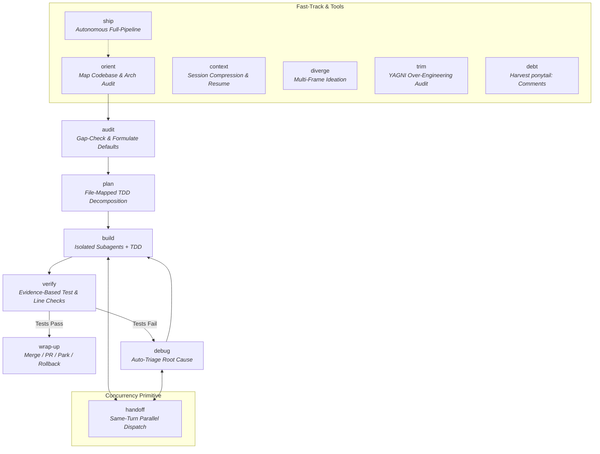

# 🍇 Ambrosia

> **The All-in-One Autonomous AI Coding Skill Suite**  
> *Built for context-rot resistance, strict TDD discipline, real parallel dispatch, and zero-friction natural language execution.*

[](https://opensource.org/licenses/MIT)
[](https://github.com/numairfm/ambrosia)

Ambrosia is a self-contained, high-performance AI software engineering framework. It bridges the gap between **implementation discipline** (Superpowers), **context-rot resistance** (GSD), and **cognitive role-framing** (GStack) into a single unified skill suite.

---

## 🚀 Quick Start (30 Seconds)

### 1. Installation

Install natively across your favorite AI agent CLI or IDE harness:

```bash
# Antigravity CLI
agy plugin install https://github.com/numairfm/ambrosia

# Claude Code
/plugin install numairfm/ambrosia

# Gemini CLI
gemini extensions install https://github.com/numairfm/ambrosia

# OpenCode.ai (add to opencode.json)
{ "plugin": ["ambrosia@git+https://github.com/numairfm/ambrosia.git"] }

# Cursor / Codex / Copilot CLI
/add-plugin https://github.com/numairfm/ambrosia
```

### 2. High-Autonomy Execution (`ship`)

Want to build a full feature without manual micromanagement? Just say:

```bash
ship "Add Redis-backed rate limiting middleware with burst unit tests"
```

Ambrosia will automatically:
1. **Audit & Gap-Check** your prompt (`audit`).
2. **Decompose** into a file-mapped TDD plan (`plan`).
3. **Execute** RED → GREEN → REFACTOR tasks using isolated subagents (`build`).
4. **Verify** with fresh test runs & line-by-line plan checks (`verify`).
5. **Present** final integration choices (`wrap-up`).

---

## ⚖️ Why Ambrosia? (Architectural Comparison)

Most AI coding tools focus on only one piece of the software delivery lifecycle. Ambrosia unifies them into a cohesive, production-ready framework:

| Feature / Capability | Superpowers | GSD (Get Shit Done) | GStack | **Ambrosia 🍇** |
|---|:---:|:---:|:---:|:---:|
| **Spec-First & Strict TDD** | ✅ Core | ✅ | ✅ | **✅ Core (`build` & `verify`)** |
| **Context-Rot Resistance** | ❌ | ✅ Core | Partial | **✅ Core (`context` & `log`)** |
| **True Concurrent Subagents** | ❌ (Single-agent) | Partial | ❌ (Personas only) | **✅ Real Same-Turn Parallelism (`handoff`)** |
| **Design & Architectural Ideation** | ❌ | ❌ | ❌ | **✅ Divergent 5-Frame Matrix (`diverge`)** |
| **YAGNI & Over-Engineering Removal** | ❌ | ❌ | ❌ | **✅ Auditable Cut Engine (`trim`)** |
| **Technical Debt Ledger** | ❌ | ❌ | ❌ | **✅ Ponytail Debt Tracking (`debt`)** |
| **Branch & PR Lifecycle Management** | ❌ | Partial | Partial | **✅ Full Wrap-up Menu (`wrap-up`)** |
| **Zero-Friction Natural Language** | Partial (CLI flags) | Partial | ✅ Slash commands | **✅ Semantic Intent Auto-Routing** |
| **High-Autonomy One-Shot Pipeline** | ❌ | ❌ | `/office-hours` | **✅ `ship <task>`** |

---

## 🔄 The SDLC Pipeline Architecture

Ambrosia relies on a portable, append-only spine (`.ambrosia/ambrosia.log.md`) to enforce clean stage gating across any LLM harness:



---

## 🛠️ The Skill Suite (14 Skills at a Glance)

Ambrosia organizes 14 focused, non-overlapping skills divided into **Spine (Pipeline)**, **Tools**, **Meta**, and **System** primitives:

### 📍 Spine Skills (SDLC Execution Core)
- **`plan`**: Decomposes audited tasks into concrete RED → GREEN → REFACTOR tasks with exact file boundaries and interface contracts.
- **`build`**: Executes plans with isolated subagents under strict TDD rules. Enforces the **Coordinator-Never-Edits Invariant** and runs mandatory independent task code reviews.
- **`verify`**: Empirical completion check. Enforces the **Iron Law:** *No completion claims without fresh verification evidence.* Verifies every requirement at a specific `file:line`.
- **`wrap-up`**: Closes out branches cleanly. Runs tests, auto-checks technical debt, prompts for YAGNI trimming, checks for leaked API secrets, and presents an interactive menu (Merge locally, Push PR, Park, or Rollback).

### 🧰 Specialized Tool Skills
- **`orient`**: Codebase mapping and architectural health checks. Supports 3 modes:
  - `orient`: Full codebase structural map (`.ambrosia/orient.md`).
  - `orient <path>`: Scoped module/directory scan (e.g. `orient src/auth`).
  - `orient audit` / *"audit architecture"*: Multi-frame architectural audit (`.ambrosia/architecture.md`) with clean pass rules.
- **`audit`**: Prompt engineer before planning. Interrogates raw requests, scores clarity (0–10), formulates sensible defaults, and tags parallel-safe tasks.
- **`debug`**: Systematic 4-phase root-cause debugging (Reproduce → Isolate → Hypothesize → Fix). Features **Auto-Triage** (auto-detects failures when prompt is empty or routed from `verify`).
- **`diverge`**: Parallel multi-frame ideation for open-ended design, naming, or fuzzy architecture questions.
  - **Lite Mode (Default/Auto):** Silently brainstorms 3 angles internally when open-ended design questions are asked.
  - **Full Mode (5-Frame Matrix):** Triggers on high-stakes choices or natural intensity signals (*"brainstorm to the max"*, *"intensely"*, *"explore every angle"*).
- **`review`**: Standalone, independent code review for branch diffs, staged changes, or specific files. Accepts natural target matching and focus instructions (e.g. *"review src/auth.ts focusing on security"*).
- **`trim`**: YAGNI auditor. Audits changes or full repos for dead code, reinvented standard library routines, and unnecessary abstractions. Hard 2-step gate: reports first, cuts only on explicit user approval.
- **`debt`**: Harvests and tracks `// ponytail: <what> | ceiling: <limit> | upgrade: <trigger>` technical debt markers into a clean, auditable ledger.
- **`context`**: Context-rot shield. Compresses current session state into `.ambrosia/context.md` and generates a clean, ready-to-paste **Resume Prompt** for switching to fresh terminal windows without losing progress.

### ⚡ Meta & System Primitives
- **`ship`**: High-autonomy pipeline accelerator. Executes `audit → plan → build → verify → wrap-up` in one continuous turn.
- **`handoff`**: Model-invoked concurrency primitive. Dispatches multiple independent subagents in the exact same response turn for true parallel execution.

---

## 🔒 Standing Behavioral Invariants

Once Ambrosia is active, the following core invariants govern all agent behavior:

> [!IMPORTANT]
> 1. **Coordinator-Never-Edits:** The coordinator agent session NEVER edits source code directly during `build`. All changes route through isolated worker subagents to keep coordinator context pristine and enforce code review loops.
> 2. **Verification Before Completion:** No task or feature is marked complete based on verbal claims or past runs. Fresh test execution with 0 failures is strictly required.
> 3. **Root Cause Before Fixes:** `debug` must isolate data flow and form an explicit hypothesis before applying code changes. Symptom-patching is prohibited.
> 4. **YAGNI & Ponytail Tagging:** Native stdlib/platform solutions take precedence over new third-party dependencies. Deliberate shortcuts must be tagged with `// ponytail:`.

---

## 💡 Practical Workflows & Examples

### Example 1: Full-Pipeline Feature Shipping
```bash
# 1. Start with ship for high autonomy
ship "Add OAuth2 Google login flow with JWT cookie management"

# 2. Ambrosia audits, plans, dispatches subagents in parallel, verifies tests,
#    and prompts you with the final wrap-up menu.
```

### Example 2: Architectural Health Check & Automated Fix
```bash
# 1. Run a high-bar architectural audit
orient audit

# 2. If issues are written to .ambrosia/architecture.md, turn them into a plan
plan .ambrosia/architecture.md

# 3. Build the fixes
build
```

### Example 3: Context-Rot Shield for Long Sessions
```bash
# 1. When session gets long or you're switching terminals:
context

# 2. Copy the generated Resume Prompt, open a new session, and paste!
# The new session reads .ambrosia/context.md and resumes immediately.
```

---

## 🛡️ License

Released under the [MIT License](LICENSE). Built for developers and AI pair-programmers who value software engineering discipline, performance, and context cleanliness.
