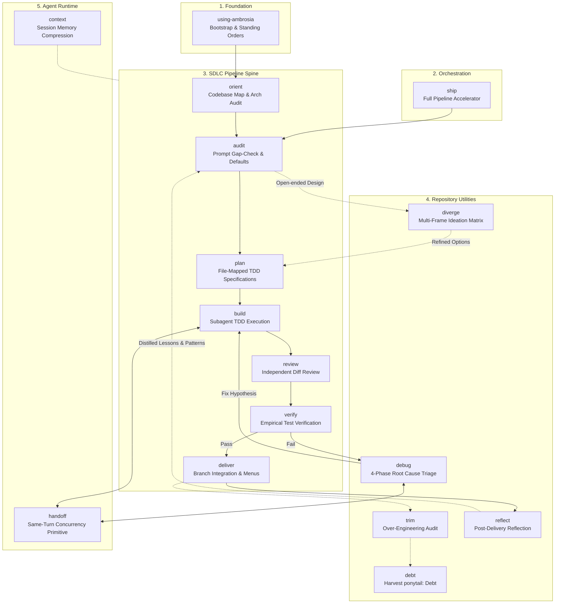

# Ambrosia

**Ambrosia is an opinionated software engineering operating system for AI coding agents.**

Instead of relying on increasingly long prompts, Ambrosia decomposes work into isolated worker subagents, enforces evidence-based verification, and eliminates context rot through a structured execution pipeline. It is not a prompt pack. It is not a collection of utilities. It is a mental model for how AI agents should engineer software.

Ambrosia operates natively in **Antigravity**, **Claude Code**, **OpenCode**, **Cursor**, **Gemini CLI**, **Codex**, and any environment supporting `SKILL.md` configurations.

---

## What Ambrosia Is Truly For

Current AI coding tools fail not because of weak prompting, but because of **context contamination and unstructured workflows**. As chat sessions grow, agents forget earlier decisions, swallow failing assertions, hallucinate API schemas, and make messy parallel edits that corrupt codebases.

Ambrosia solves this by operationalizing software engineering discipline:

1. **Context Isolation Over Prompt Inflation:** Coordinators manage state and plans; isolated subagents write code and execute tests in fresh token windows. Context rot is eliminated.
2. **Deterministic SDLC Over Random Utilities:** Work flows sequentially through a proven pipeline (`orient` → `audit` → `plan` → `build` → `review` → `verify` → `deliver`), rather than relying on arbitrary ad-hoc prompts.
3. **Empirical Evidence Over Verbal Confidence:** No feature is marked complete without fresh test execution output demonstrating zero failures.
4. **Observable Technical Debt:** Deliberate shortcuts are explicitly tagged with `// ponytail:` comments and tracked via a live technical debt ledger.

---

## The Seven Principles

1. **Context is finite.** Treat every token as a resource. Isolate workers. Compress coordinators. Never let context rot destroy a long session.

2. **Plans outlive prompts.** A prompt disappears when the chat ends. A file-mapped plan with explicit interfaces and test contracts survives sessions, agents, and reboots.

3. **Evidence beats confidence.** No completion claim is valid without fresh test output. "It should work" is not verification.

4. **Parallelize thought, not edits.** Run cognitive frames in parallel during design. Serialize file changes to avoid conflicts. Think wide, write narrow.

5. **Small workers, strong coordinator.** The coordinator orchestrates and integrates. Workers implement and commit. The coordinator never touches source files directly.

6. **Delete aggressively.** Abstractions, dependencies, and dead code all have carrying costs. Remove anything that does not exist to serve a current, verified requirement.

7. **Leave the repository healthier than you found it.** Every session should end with cleaner code, clearer documentation, and fewer open questions than it started with.

---

## Quick Start

### Installation

```bash
# Antigravity CLI
agy plugin install https://github.com/numairfm/ambrosia

# Claude Code
/plugin install numairfm/ambrosia

# Gemini CLI
gemini extensions install https://github.com/numairfm/ambrosia

# OpenCode.ai (add to opencode.json)
{ "plugin": ["ambrosia@git+https://github.com/numairfm/ambrosia.git"] }

# Cursor / Codex / Copilot CLI
/add-plugin https://github.com/numairfm/ambrosia
```

### High-Autonomy Execution (`ship`)

To execute a feature end-to-end through the full pipeline with minimal manual intervention:

```bash
ship "Add Redis rate limiting middleware with unit tests"
```

The `ship` skill wraps the pipeline automatically:
1. `audit` — Gap-checks the prompt and formulates default assumptions.
2. `plan` — Decomposes the task into RED -> GREEN -> REFACTOR subtasks.
3. `build` — Dispatches worker subagents to write failing tests, pass them, and submit to an independent reviewer subagent.
4. `review` — Independent diff review before verification. Catches spec deviations, security holes, and over-engineering.
5. `verify` — Runs the complete test suite and verifies line-by-line implementation against the plan.
6. `deliver` — Presents final integration choices (merge, pull request, park, or rollback).

---

## Skill Architecture & OS Structure

Ambrosia's 16 skills are structured like a lightweight software engineering operating system across five functional layers:



### Why Ambrosia Enforces Hard Stage Boundaries

Ambrosia prevents skill inflation by maintaining strict boundaries between stages:

- **Planning produces specifications, not edits:** The planner never writes source code.
- **Builders implement specs but never approve themselves:** Task diffs must pass independent review.
- **Reviewers evaluate quality and security independently:** Diff review runs before verification.
- **Verification requires empirical test execution:** Verbal claims ("it should work") are rejected.
- **Reflection distills durable knowledge:** Post-delivery lessons feed directly into future task audits.

### Workflow Handshakes & Inter-Skill Communication

1. **Intake to Design Handshake:** `using-ambrosia` initializes session orders $\rightarrow$ `orient` maps the repository $\rightarrow$ `audit` gap-checks the raw user prompt. If the task involves open-ended design choices, `audit` routes to `diverge` for multi-frame ideation before passing refined requirements to `plan`.
2. **Specification to Build Handshake:** `plan` generates file-mapped TDD specifications in `.ambrosia/plans/`. `build` reads the spec and uses `handoff` to launch isolated worker subagents for parallel tasks.
3. **Review & Empirical Verification Gate:** `build` submits task diffs to `review` for independent quality/security checks. Once clean, `verify` runs the full test suite. If `verify` fails, control routes to `debug` for root-cause triage, which feeds fixed code back to `verify`.
4. **Integration & Learning Loop:** Green verification triggers `trim` (YAGNI over-engineering audit) and `debt` (ponytail tracking) before `deliver` presents branch integration options (Merge, PR, Park, Rollback). After delivery, `reflect` distills lessons into 3 pillars (**Lessons**, **Patterns**, **Debt**) which inform the next task's `audit`.

---

## Comparison with Existing Frameworks

| Feature / Metric | Superpowers | GSD (Get Shit Done) | GStack | Ambrosia |
|---|---|---|---|---|
| **Primary Focus** | TDD & Plan Discipline | Context Rot & Memory Files | Role-Based Persona Gearing | Unified SDLC & Parallel Execution |
| **Execution Model** | Single Agent | Sub-agent Waves | Persona Framing | Isolated Worker Subagents + Coordinator |
| **Parallel Dispatch** | No | Partial | No | Yes (Same-turn `handoff` primitive) |
| **Exploratory Ideation** | No | No | No | Yes (Multi-frame `diverge` matrix) |
| **YAGNI / Debt Audit** | No | No | No | Yes (`trim` engine & `debt` ledger) |
| **State Persistence** | Transient | Markdown Specs | Terminal State | Portable `.ambrosia/ambrosia.log.md` |
| **Natural Language Routing** | CLI Flags | Command Files | Slash Commands | Natural Intent & Semantic Matching |
| **Post-Delivery Reflection** | No | No | No | Yes (`reflect` skill) |

---

## Skill Reference (16 Skills)

### 1. Foundation & Orchestration
* **`using-ambrosia`**: Suite introduction, orientation, and standing behavioral orders (context isolation, ponytail YAGNI, prompt auditing, harness rules).
* **`ship`**: High-autonomy pipeline accelerator. Wraps and executes `audit → plan → build → review → verify → deliver` in one continuous run.

### 2. SDLC Pipeline Spine
* **`orient`**: Scans and maps codebases. Supports `orient` (full map to `.ambrosia/orient.md`), `orient <path>` (scoped module scan), and `orient audit` (architectural audit to `.ambrosia/architecture.md`).
* **`audit`**: Interrogates raw prompts, rates clarity, formulates default assumptions for minor gaps, and tags parallel-safe tasks.
* **`plan`**: Decomposes tasks into atomic RED -> GREEN -> REFACTOR implementation tasks with exact file locations and interface definitions.
* **`build`**: Executes plans using isolated worker subagents. Enforces strict TDD and dispatches an independent reviewer subagent for every task.
* **`review`**: First-class pipeline stage. Independent diff review after build, before verify. Checks spec compliance, security, correctness, and over-engineering.
* **`verify`**: Enforces empirical verification. Runs the test suite and verifies each plan requirement at a specific `file:line`.
* **`deliver`**: Handles branch integration. Runs tests, checks technical debt, prompts for YAGNI trimming, scans for sensitive tokens, and presents local merge, pull request, park, or rollback options.

### 3. Repository Utilities
* **`diverge`**: Multi-frame ideation tool. Runs isolated cognitive frames (*Regulator*, *Compiler*, *Archaeologist*, *Hardware*) in parallel to evaluate complex architectural decisions without anchoring bias.
* **`debug`**: 4-phase root-cause debugging engine (Reproduce -> Isolate -> Hypothesize -> Fix). Includes automatic failure triage when invoked without a stack trace.
* **`trim`**: YAGNI auditor. Identifies dead code, reinvented standard library routines, and unnecessary abstractions. Hard two-step gate: reports findings first, applies cuts only on explicit approval.
* **`debt`**: Greps repository for `// ponytail: <what> | ceiling: <limit> | upgrade: <trigger>` comments and outputs a tracked technical debt ledger.
* **`reflect`**: Post-delivery reflection skill. Distills durable lessons, reusable patterns, and tracked technical debt into a 3-pillar summary.

### 4. Agent Runtime
* **`context`**: Session memory compression tool. Writes current status, completed tasks, and blockers to `.ambrosia/context.md` and generates a clean resume prompt for switching context windows.
* **`handoff`**: System-level concurrency primitive. Dispatches multiple subagents in the same response turn for true parallel execution.

---

## Core Invariants

1. **Coordinator Invariant:** The main coordinator session never edits source files directly during `build`. All modifications must be made by worker subagents.
2. **Verification Invariant:** No completion claims are valid without fresh test execution output showing zero failures.
3. **Root Cause Invariant:** Fixes must be preceded by an explicit hypothesis and data flow isolation in `debug`.
4. **YAGNI Invariant:** Platform primitives and standard library functions must be preferred over new abstractions or dependencies.

---

## Lineage and Conceptual Sources

Ambrosia is a synthesis of concepts from several open-source agent frameworks:

* **[obra/superpowers](https://github.com/obra/superpowers):** Provides the core methodology backbone — strict TDD discipline (RED -> GREEN -> REFACTOR), task-level subagent isolation, file-mapped implementation plans, and independent review gates.
* **[uditakhourii/adhd](https://github.com/uditakhourii/adhd):** Provides the foundation for the `diverge` skill. It uses isolated cognitive frames (*Hardware*, *Compiler*, *Regulator*, *Archaeologist*) running in parallel to prevent anchoring bias during design decisions.
* **[open-gsd/gsd-core](https://github.com/open-gsd/gsd-core):** Provides the context-rot defense model. Inspires Ambrosia's `.ambrosia/` workspace directory, coordinator context compression, append-only log spine (`ambrosia.log.md`), and session resume snapshots (`context`).
* **[mattpocock/skills](https://github.com/mattpocock/skills):** Inspires the skill configuration standard (`SKILL.md`), parameter passing conventions, and clear separation between model-invoked primitives (`handoff`) and user-facing tools.
* **[safishamsi/ponytail](https://github.com/safishamsi/ponytail):** Provides the YAGNI auditing principles used by `trim` and `debt`, introducing the structured `// ponytail:` comment format for tracking deliberate technical debt.

---

## License

[MIT License](LICENSE)
